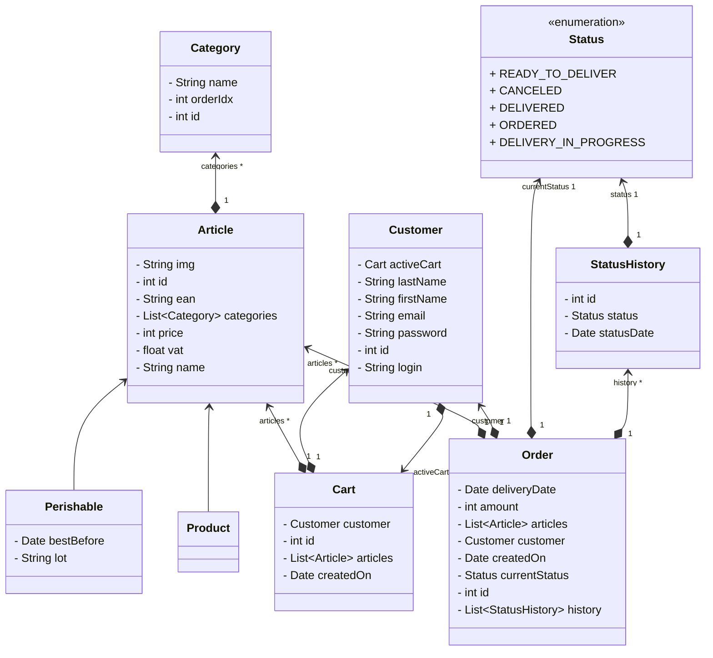
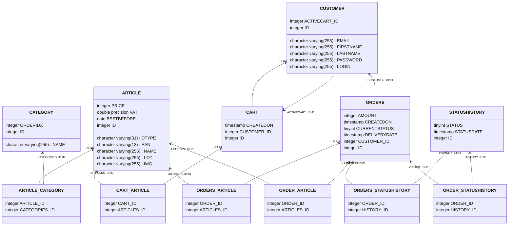

# lid-api
Life Event Distribution Api repository

# Conception : Modèle de données JPA pour le site de e-commerce LID.

## Modèle UML :

## Modèle physique de base de donnée :

* Les identifiants sont numériques (int), et auto-générés.
* Article
  * Le champ `ean13` est le code-barre de l'article, codé sur 13 caractères.
  * `vat` est le taux de tva. (0.20 = 20%).
* Category
  * `orderIdx` est un entier qui permettra de trier les produits selon un ordre donné par l'administrateur.  
* Perishable
  * `lot` représente un texte permettant de dissocier les livraisons de produits frais.  

