# lid-api
Life Event Distribution Api repository

# Run du projet

## Prérequis
- Java 21
- Maven Wrapper (`./mvnw`)
- Docker + Docker Compose (pour PostgreSQL local)

## 1) Run local rapide (H2 en mémoire)
Depuis `lid/` :

```bash
cd lid
./mvnw spring-boot:run
```

API disponible sur `http://localhost:9000`.


## 2) (optionnel : recréation des tables) Générer le DDL PostgreSQL (`deployment/ddl.sql`)
Le projet fournit un profil dédié `ddl-postgres` (fichier `lid/src/main/resources/application-ddl-postgres.yaml`).

Depuis `lid/` :

```bash
cd /Users/jeanemmanuel/Desktop/company-projects/lid/lid-api/lid
rm -f ../deployment/ddl.sql
SPRING_PROFILES_ACTIVE=ddl-postgres ./mvnw -DskipTests spring-boot:run
```

Puis :
1. Attendre le log `Started LidApplication`
2. Stopper le process (`Ctrl+C`)
3. Vérifier le fichier généré : `deployment/ddl.sql`


## 3) Run local en mode DB prod-like (PostgreSQL)
Un profil dédié existe : `application-db-prod.yml` (profil Spring `db-prod`).

### Charger toutes les variables depuis `env/.env.local`
Depuis la racine du repo (`lid-api/`) :

```bash
set -a
source env/.env.local
set +a
```

### Démarrer uniquement la base PostgreSQL locale et redis
Depuis `deployment/` :

```bash
docker rm -f lid-db
# Optionnel si tu as changé POSTGRES_USER/POSTGRES_PASSWORD et que l'ancien volume persiste :
# docker volume rm lid-db-data

docker run -d \
  --name lid-db \
  -p 55432:5432 \
  -e POSTGRES_USER=${POSTGRES_USER} \
  -e POSTGRES_PASSWORD=${POSTGRES_PASSWORD} \
  -e POSTGRES_DB=${POSTGRES_DB} \
  -v lid-db-data:/var/lib/postgresql/data \
  -v /Users/jeanemmanuel/Desktop/company-projects/lid/lid-api/deployment/ddl.sql:/docker-entrypoint-initdb.d/10-ddl.sql:ro \
  postgres:15


docker rm -f lid-redis

docker run -d \
  --name lid-redis \
  -p 6379:6379 \
  -v lid-redis-data:/data \
  redis:7.2-alpine \
  redis-server --maxmemory 512mb --maxmemory-policy allkeys-lru
```

Vérification rapide :

```bash
docker exec -it lid-db psql -U "${POSTGRES_USER}" -d "${POSTGRES_DB}" -c "select 1;"
```

### Lancer l'API en local connectée à PostgreSQL (`db-prod`) avec toutes les variables
Depuis `lid-api/lid/` :

```bash
unset SPRING_DATASOURCE_HIKARI_CONNECTION

SPRING_PROFILES_ACTIVE=db-prod \
SPRING_DATASOURCE_URL=jdbc:postgresql://localhost:55432/${POSTGRES_DB} \
SPRING_DATASOURCE_DRIVER_CLASS_NAME=org.postgresql.Driver \
SPRING_DATASOURCE_USERNAME=${POSTGRES_USER} \
SPRING_DATASOURCE_PASSWORD=${POSTGRES_PASSWORD} \
SPRING_DATASOURCE_HIKARI_MAXIMUM_POOL_SIZE=${HIKARI_MAXIMUM_POOL_SIZE} \
SPRING_DATASOURCE_HIKARI_MINIMUM_IDLE=${HIKARI_MINIMUM_IDLE} \
SPRING_DATASOURCE_HIKARI_IDLE_TIMEOUT=${HIKARI_IDLE_TIMEOUT} \
SPRING_DATASOURCE_HIKARI_MAX_LIFETIME=${HIKARI_MAX_LIFETIME} \
SPRING_DATASOURCE_HIKARI_CONNECTION_TIMEOUT=${HIKARI_CONNECTION_TIMEOUT} \
SPRING_MAIL_HOST=${SMTP_HOST} \
SPRING_MAIL_PORT=${SMTP_PORT} \
SPRING_MAIL_USERNAME=${SMTP_USERNAME} \
SPRING_MAIL_PASSWORD=${SMTP_PASSWORD} \
SPRING_MAIL_PROPERTIES_MAIL_SMTP_AUTH=${SMTP_AUTH} \
SPRING_MAIL_PROPERTIES_MAIL_SMTP_STARTTLS_ENABLE=${SMTP_STARTTLS_ENABLE} \
SPRING_MAIL_PROPERTIES_MAIL_SMTP_STARTTLS_REQUIRED=${SMTP_STARTTLS_REQUIRED} \
CONFIG_MAIL_FROM=${SMTP_FROM} \
CONFIG_BACKOFFICE_MESSAGES_DEFAULT_RECIPIENTS=${BACKOFFICE_MESSAGES_DEFAULT_RECIPIENTS} \
CONFIG_BACKOFFICE_MESSAGES_RETRY_DELAY_MS=${BACKOFFICE_MESSAGES_RETRY_DELAY_MS} \
CONFIG_MARKETING_DISPATCH_DELAY_MS=${MARKETING_DISPATCH_DELAY_MS} \
CONFIG_MARKETING_DISPATCH_MAX_CAMPAIGNS_PER_RUN=${MARKETING_DISPATCH_MAX_CAMPAIGNS_PER_RUN} \
CONFIG_MARKETING_DISPATCH_BATCH_SIZE=${MARKETING_DISPATCH_BATCH_SIZE} \
APP_JWT_SECRET_KEY=${APP_JWT_SECRET_KEY} \
APP_ISSUER=${APP_ISSUER} \
APP_ACCESS_TTL_MINUTES=${APP_ACCESS_TTL_MINUTES} \
APP_REFRESH_TTL_DAYS=${APP_REFRESH_TTL_DAYS} \
APP_RESET_CODE_TTL_MINUTES=${APP_RESET_CODE_TTL_MINUTES} \
GOOGLE_ISSUER_URI=${GOOGLE_ISSUER_URI} \
GOOGLE_JWK_SET_URI=${GOOGLE_JWK_SET_URI} \
GOOGLE_CLIENT_ID=${GOOGLE_CLIENT_ID} \
PAYDUNYA_MODE=${PAYDUNYA_MODE} \
PAYDUNYA_MASTER_KEY=${PAYDUNYA_MASTER_KEY} \
PAYDUNYA_PRIVATE_KEY=${PAYDUNYA_PRIVATE_KEY} \
PAYDUNYA_PUBLIC_KEY=${PAYDUNYA_PUBLIC_KEY} \
PAYDUNYA_TOKEN=${PAYDUNYA_TOKEN} \
PAYDUNYA_CALLBACK_URL=${PAYDUNYA_CALLBACK_URL} \
PAYDUNYA_RETURN_URL=${PAYDUNYA_RETURN_URL} \
PAYDUNYA_CANCEL_URL=${PAYDUNYA_CANCEL_URL} \
PAYDUNYA_STORE_NAME="${PAYDUNYA_STORE_NAME}" \
PAYDUNYA_STORE_TAGLINE="${PAYDUNYA_STORE_TAGLINE}" \
PAYDUNYA_STORE_PHONE_NUMBER=${PAYDUNYA_STORE_PHONE_NUMBER} \
PAYDUNYA_STORE_POSTAL_ADDRESS="${PAYDUNYA_STORE_POSTAL_ADDRESS}" \
PAYDUNYA_STORE_WEBSITE_URL=${PAYDUNYA_STORE_WEBSITE_URL} \
PAYDUNYA_STORE_LOGO_URL=${PAYDUNYA_STORE_LOGO_URL} \
PAYDUNYA_SUPPORTED_COUNTRIES="${PAYDUNYA_SUPPORTED_COUNTRIES}" \
CORS_ALLOWED_ORIGIN_PATTERNS="${CORS_ALLOWED_ORIGIN_PATTERNS}" \
CORS_ALLOWED_METHODS="${CORS_ALLOWED_METHODS}" \
CORS_ALLOWED_HEADERS="${CORS_ALLOWED_HEADERS}" \
CORS_ALLOW_CREDENTIALS=${CORS_ALLOW_CREDENTIALS} \
CORS_MAX_AGE=${CORS_MAX_AGE} \
./mvnw spring-boot:run
```

Important :
- Cette commande couvre les variables standards `mail/google/paydunya/backoffice/marketing/cors`.
- Le conteneur Postgres et l'API doivent utiliser le même couple `${POSTGRES_USER}` / `${POSTGRES_PASSWORD}`.
- Si tu gardes un ancien volume `lid-db-data`, Postgres conserve les anciens identifiants initiaux.

## 4) Stratégie de cache (implémentée)
Le projet utilise Spring Cache + Caffeine (`CatalogCacheConfig`) avec invalidation événementielle après commit transaction (`@TransactionalEventListener(phase = AFTER_COMMIT)`).

### Caches actifs et TTL
- `catalog_collection`: 5 min
- `catalog_categories`: 24 h
- `catalog_featured_categories`: 6 h
- `catalog_products_featured`: 20 min
- `catalog_products_bestsellers`: 20 min
- `catalog_products_latest`: 5 min
- `catalog_product_details`: 20 min
- `catalog_product_reviews`: 10 min
- `blog_posts`: 30 min
- `blog_post_details`: 30 min
- `tickets`: 30 min
- `ticket_details`: 30 min

### Endpoints/lectures cachés
- Catalog:
  - featured, bestsellers, latest, product details
  - categories, featured categories
  - product reviews
  - aggregate `getCollection` uniquement quand `q/category` sont vides (pas de cache sur recherche produit)
- Blog:
  - liste + détail
- Tickets:
  - liste + détail

### Invalidation fiable (CRUD)
Des événements de domaine sont publiés côté write:
- `ProductCatalogChangedEvent`
- `CategoryCatalogChangedEvent`
- `BlogCatalogChangedEvent`
- `TicketCatalogChangedEvent`
- `ReviewCatalogChangedEvent`

Puis `CatalogCacheInvalidationListener` délègue à `CatalogCacheInvalidator`:
- Produit modifié: purge listes catalog + featured/bestseller/latest + détails produit impacté + reviews
- Catégorie modifiée: purge listes catalog + catégories + featured catégories + détails/reviews produits
- Blog modifié: purge `blog_posts`, `blog_post_details`, `catalog_collection`
- Ticket modifié: purge `tickets`, `ticket_details`, `catalog_collection`
- Review modifiée: purge listes catalog + détails produit impacté + reviews

### Vérification rapide
Depuis `lid/`:
```bash
./mvnw -q -DskipTests compile
```
Le build doit passer vert après toute modification de stratégie cache/invalidation.


# A ne pas oublier 

- gestion du SameSite dans le cookie (confirmer cross domain ?)
- Reste la gestion des rôles


## LID Database (from `deployment/ddl.sql`)

```mermaid
erDiagram
  ARTICLE {
    bigint id PK
    varchar name
    varchar sku
    varchar status
  }
  CATEGORY {
    int id PK
    varchar name
    varchar slug
  }
  ARTICLE_CATEGORIES {
    bigint article_id FK
    int categories_id FK
  }
  USER_ENTITY {
    varchar user_id PK
    varchar email
    varchar user_type
  }
  CUSTOMER {
    varchar user_id PK
  }
  AUTHENTICATION {
    varchar user_id PK
    varchar type
  }
  AUTHENTICATION_ROLES {
    varchar authentication_user_id FK
    varchar roles
  }
  CART {
    int id PK
    varchar customer_user_id FK
  }
  CART_ARTICLE {
    int id PK
    int cart_id FK
    bigint article_id FK
  }
  ORDERS {
    bigint id PK
    varchar customer_user_id FK
    varchar current_status
  }
  ORDER_ARTICLE {
    bigint id PK
    bigint order_id FK
    bigint article_id FK
  }
  STATUS_HISTORY {
    bigint id PK
    bigint order_id FK
    varchar status
  }
  STOCK {
    bigint id PK
    bigint article_id FK
  }
  STOCK_MOVEMENT {
    bigint id PK
    bigint article_id FK
  }
  WISHLIST {
    bigint id PK
    varchar customer_user_id FK
    bigint article_id FK
  }
  PRODUCT_REVIEW {
    bigint id PK
    varchar customer_id FK
    bigint article_id FK
  }
  PRODUCT_REVIEW_LIKE {
    bigint id PK
    bigint review_id FK
    varchar user_id FK
  }
  PRODUCT_REVIEW_REPORT {
    bigint id PK
    bigint review_id FK
    varchar user_id FK
  }
  CUSTOMER_ADDRESS {
    varchar id PK
    varchar customer_id FK
  }
  LOYALTY_POINT_ADJUSTMENT {
    bigint id PK
    varchar customer_user_id FK
  }
  MARKETING_CAMPAIGN {
    bigint id PK
  }
  MARKETING_CAMPAIGN_DELIVERY {
    bigint id PK
    bigint campaign_id FK
  }
  EMAIL_MESSAGE {
    bigint id PK
  }
  EMAIL_MESSAGE_RECIPIENT {
    bigint message_id FK
    varchar recipient
  }
  PAYMENT {
    bigint id PK
  }
  PAYMENT_TRANSACTIONS {
    bigint id PK
    bigint payment_id FK
  }
  REFUNDS {
    bigint id PK
    bigint payment_id FK
  }
  RETURN_REQUEST {
    bigint id PK
  }
  RETURN_REQUEST_ITEM {
    bigint id PK
    bigint return_request_id FK
  }
  SHOP {
    bigint shop_id PK
    int main_category_id FK
  }
  PARTNER {
    varchar user_id PK
    bigint shop_id FK
  }
  PASSWORD_RESET_TOKEN {
    uuid id PK
    varchar user_id FK
  }

  ARTICLE ||--o{ ARTICLE_CATEGORIES : "article_id"
  CATEGORY ||--o{ ARTICLE_CATEGORIES : "categories_id"
  AUTHENTICATION ||--o{ AUTHENTICATION_ROLES : "authentication_user_id"

  USER_ENTITY ||--|| CUSTOMER : "user_id"
  CUSTOMER ||--o{ CUSTOMER_ADDRESS : "customer_id"
  CUSTOMER ||--o{ CART : "customer_user_id"
  CART ||--o{ CART_ARTICLE : "cart_id"
  ARTICLE ||--o{ CART_ARTICLE : "article_id"

  CUSTOMER ||--o{ ORDERS : "customer_user_id"
  ORDERS ||--o{ ORDER_ARTICLE : "order_id"
  ARTICLE ||--o{ ORDER_ARTICLE : "article_id"
  ORDERS ||--o{ STATUS_HISTORY : "order_id"

  ARTICLE ||--o{ STOCK : "article_id"
  ARTICLE ||--o{ STOCK_MOVEMENT : "article_id"
  ARTICLE ||--o{ WISHLIST : "article_id"
  CUSTOMER ||--o{ WISHLIST : "customer_user_id"

  ARTICLE ||--o{ PRODUCT_REVIEW : "article_id"
  CUSTOMER ||--o{ PRODUCT_REVIEW : "customer_id"
  PRODUCT_REVIEW ||--o{ PRODUCT_REVIEW_LIKE : "review_id"
  USER_ENTITY ||--o{ PRODUCT_REVIEW_LIKE : "user_id"
  PRODUCT_REVIEW ||--o{ PRODUCT_REVIEW_REPORT : "review_id"
  USER_ENTITY ||--o{ PRODUCT_REVIEW_REPORT : "user_id"

  CUSTOMER ||--o{ LOYALTY_POINT_ADJUSTMENT : "customer_user_id"
  MARKETING_CAMPAIGN ||--o{ MARKETING_CAMPAIGN_DELIVERY : "campaign_id"
  EMAIL_MESSAGE ||--o{ EMAIL_MESSAGE_RECIPIENT : "message_id"

  PAYMENT ||--o{ PAYMENT_TRANSACTIONS : "payment_id"
  PAYMENT ||--o{ REFUNDS : "payment_id"
  RETURN_REQUEST ||--o{ RETURN_REQUEST_ITEM : "return_request_id"

  CATEGORY ||--o{ SHOP : "main_category_id"
  SHOP ||--o| PARTNER : "shop_id"
  USER_ENTITY ||--o| PARTNER : "user_id"
  USER_ENTITY ||--o{ PASSWORD_RESET_TOKEN : "user_id"
```


