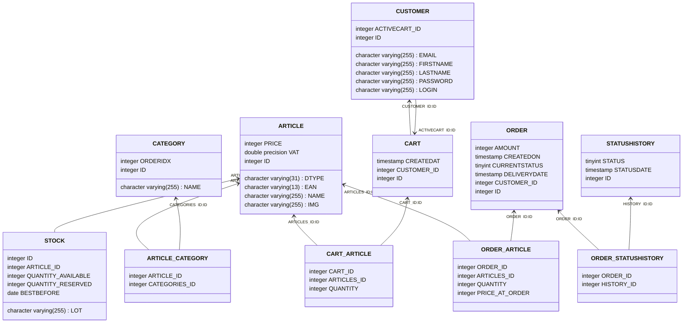

# lid-api
Life Event Distribution Api repository

# A ne pas oublier 

- gestion du SameSite dans le cookie (confirmer cross domain ?)
- est ce que 1 partner à 1 boutique ou plusieurs partners ont 1 boutique ? et qu'est ce qu'un partenaire peut faire (à part la gestion d'articles).
- Reste la gestion des rôles
- Lors de la création d'un partenaire, il faut que des mains catégories existent
- Comment se log un partenaire ?
- 

## Modèle physique de base de donnée pour le site de e-commerce LID.

* Les identifiants sont numériques (int), et auto-générés.
* Article
  * Le champ `sku` est l'identifiant produit de l'article.
  * Le champ `ean13` est le code-barre de l'article.
  * `vat` est le taux de tva. (0.18 = 18% en CIV).
* Category
  * `orderIdx` est un entier qui permettra de trier les produits selon un ordre donné par l'administrateur.  
* Perishable
  * `lot` représente un texte permettant de dissocier les livraisons de produits frais.  

## Synchroniser Swagger vers Postman (automatique)

Le projet contient un workflow GitHub Actions: `.github/workflows/sync-postman.yml`.

Fonctionnement:
- déclenchement à chaque push qui modifie `collection/openapi.yaml`
- conversion OpenAPI -> collection Postman
- mise à jour de la collection Postman via l'API Postman

### Secrets GitHub à ajouter

Dans le repo GitHub (`Settings > Secrets and variables > Actions`):

- `POSTMAN_API_KEY`: clé API Postman
- `POSTMAN_COLLECTION_UID`: UID de la collection Postman à mettre à jour (ex: `12345678-aaaa-bbbb-cccc-ddddeeeeffff`)

### Où récupérer le `POSTMAN_COLLECTION_UID`

Dans Postman, ouvre la collection cible puis récupère l'UID depuis l'URL ou via l'API Postman.

### Important

Le workflow se base sur `collection/openapi.yaml`. Si ton Swagger runtime (`/v3/api-docs`) change, pense à mettre à jour ce fichier pour déclencher la sync.

## Régénérer `openapi.yaml` automatiquement

Un 2e workflow est disponible: `.github/workflows/refresh-openapi.yml`.

Fonctionnement:
- déclenchement sur push (code backend) ou manuel
- téléchargement du Swagger depuis une URL distante
- mise à jour de `collection/openapi.yaml`
- commit/push automatique si changement détecté

### Secret GitHub requis

Ajoute dans `Settings > Secrets and variables > Actions`:

- `LID_API_DOCS_URL`: URL complète de ton Swagger YAML (ex: `https://api.mon-domaine.com/v3/api-docs.yaml`)

Quand ce workflow met à jour `collection/openapi.yaml`, le workflow de sync Postman se déclenche automatiquement.
